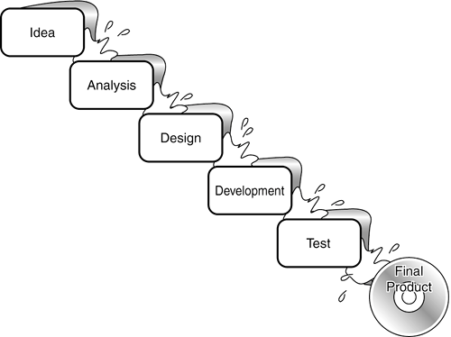
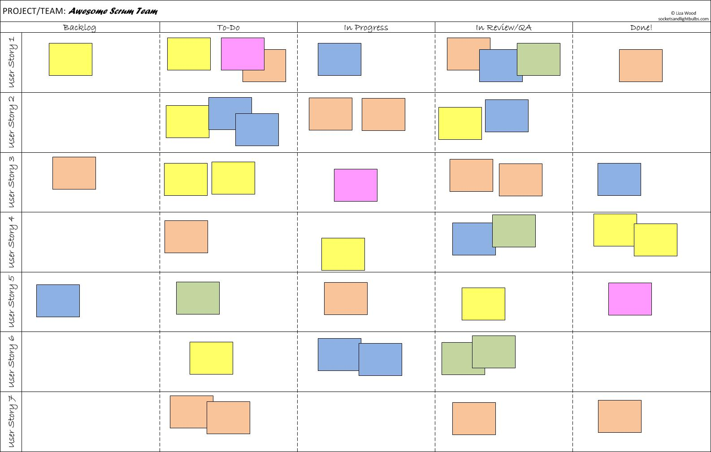

 
Is it scrum or are the waterfalls just a bit smaller?

Mapping waterfall to the scrum process:
| Waterfall stage | Scrum name |
| --------------- | ---------- |
| Idea
| Analysis
| Design
| 

=====================================================
-   Scrum doesn’t help you
-   Only thing it does is forcing you to fit the waterfall in a sprint

1. Why is a waterfall bad?
--------------------------
-   It increases time the throughput time
-   It increases the need for documentation (hand over between the lanes)
-   Focus on moving thing to the next lane instead of getting things ‘done’
 

2. How to fight it?
-------------------
-   Restrict number of items in a swimming lane
-   Pairing
-   Test automation
-   Make stories smaller can help

